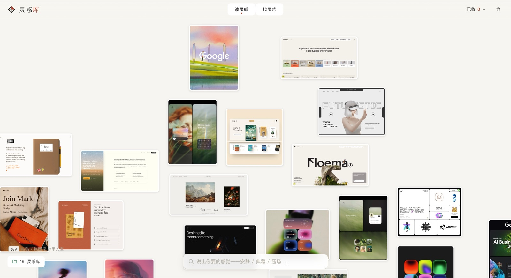

<div align="center">

# Cabinet · 灵感库

**把说不清的感觉，翻译成 AI 能造出来的东西。**

by 布灵布灵灵 · [小红书](https://xhslink.com/m/1ht5s0trmNo) · [在线体验](https://cabinet-lingganku.vercel.app/) · [English](./README.en.md)

MIT · 纯浏览器运行 · 无后端



</div>

---

## 解决什么问题

你看到一个设计，感觉到*某种东西*——安静、高级、有生命——可一旦让 AI "做出那种感觉"，话说出来是模糊的，结果回来是平庸的。

差的是那份**感觉从没被拆成可迁移的手法**。

Cabinet 就做这件事：把一张参考图拆成 **facet（手法）**——有名字、能复用的最小单元，交给你的 coding agent 当精确指令，迁移技法，而不是照搬画面。

> **收藏夹 / mood board** 解决的是："看到好东西，先存起来。"
>
> **Cabinet** 解决的是："这种感觉，怎么做进我自己的产品？"

**先感受一下** → [在线体验版](https://cabinet-lingganku.vercel.app/)，「找灵感」中也放了高质量的设计参考网站，一站式找灵感，读灵感，用灵感。

---

## 产品理念：临摹，是为了离帖

借鉴从来不是把原作复刻一遍，而是向它学习。美术和中国书法的启蒙都是「临摹」——但**临摹的目的从不是那张摹本**，而是把一个东西「为什么成立」吃进去，直到能离帖，画出自己的画，写出自己的字。

到了 AI 时代，临摹不再只是手眼的训练。真正值得练的，是**观察与表达**——

*我喜欢的到底是哪一部分？*
*是什么手法营造了这种感觉？*
*换作我自己的作品，会怎样把它表达出来？*

Cabinet 不给你整图 prompt，而是在使用中去学习作者使用了什么手法、以及它为什么起作用，再尝试把**技法**迁移过来。**在学中用，在用中学**，而不是做一个别人成品的复制件。

---

## 使用方式

Cabinet 是**一个带可视前端的 Claude Code 项目**——浏览器页面用来「看」，你的 coding agent 才是「干活」的地方。开始前确认两样东西：**Claude Code** + 一个 **Chromium 内核浏览器**（Chrome / Edge）。

### 方式一：macOS / Linux

复制这三行，装一次：

```bash
git clone https://github.com/pxx-design/cabinet
cd cabinet
./setup/install.sh
```

`install.sh` 装好 `/translate` + `转译` 触发器，并第一次替你打开 app。macOS 还会装一个自动入库 watcher——点「入库」即自动拆（加 `--no-watcher` 跳过）；Linux 上点「入库」暂存后，在 Claude Code 里敲 `/ingest`。

### 方式二：Windows

同样三行，但要在 **Git Bash** 里跑（装过 Git for Windows 就有；Claude Code 在 Windows 上本来就依赖它）：

```bash
git clone https://github.com/pxx-design/cabinet
cd cabinet
./setup/install.sh
```

三点不同：

- 粘图用 **`Ctrl+V`**。
- 没有自动入库 watcher——点「入库」暂存后，在 Claude Code 里敲 `/ingest`。
- 裸词 `转译` 触发**未在 Windows 上实测**；`/translate` 是一样的，用它。

> Windows 路径未经完整实测。若哪一步跑不通，直接走方式三——页面本身、`/ingest`、`/translate` 都是跨平台机制，不依赖安装脚本。

### 方式三：整段贴给 Claude Code（全平台）

不想碰命令行，就把这段话原样贴给 Claude Code，它替你装：

```text
帮我装好 Cabinet：git clone https://github.com/pxx-design/cabinet && cd cabinet，
运行 ./setup/install.sh，并在浏览器打开 index.html。然后告诉我点左下「连接」选 cabinet
文件夹。我每次把参考粘进页面、点「入库」，你就运行 /ingest。
```

### 唯一要你手动的一步

浏览器安全，谁都自动不了：第一次照页面左下的提示（那颗脉冲红点）——点「连接」→ 选这个 `cabinet` 文件夹 →「允许」。这一步让页面能写盘。只此一次。

**以后再开，直接双击 `index.html`**——现代 Chrome 下就是全功能。若浏览器在 `file://` 下拦了文件夹授权，改用 `./start.sh`（localhost）。

---

## 日常就两个动作

- **入库 `/ingest`** —— 把参考粘进页面（`⌘V` / `Ctrl+V`，或直接丢进 `_inbox/`），点「入库」。agent 读 [`INGEST.md`](./INGEST.md) 把每张图拆成手法：`zh/en` 命名、图上锚点、感觉词、为什么起作用、怎么对 AI 说、借鉴边界。macOS 装了 watcher 就全自动；其他系统敲一句 `/ingest`。
- **转译 `/translate`** —— 在*任何*项目里，agent 读你选好的手法（`_desk.json`），结合你正在做的产品，先出转译稿、你确认后再动代码。


**防照搬是结构性的**：手法只带 `say`（说法），不带整图 prompt；`tune` 边界随手法走；配色不自动带过来。规范是 agent 中立的——Claude Code 用 `/ingest`，其他 agent 直接读 `INGEST.md`（见 [`AGENTS.md`](./AGENTS.md)）。

---

## 模型：感觉 ← 手法 ← 参考

- **参考（plate）**——你收集的一张截图或图像。
- **手法（facet）**——参考上的一个具体技法：*柔彩渐变*、*邮政拟物道具*、*照片打底 UI*。命名到 AI 认得，收口到能迁移进你的产品。
- **感觉**——涌现出来的。一张参考之所以"有那种感觉"，是它叠的那些手法共同达成的。感觉词长在手法上，不在图上。

## 三层架构

```
浏览器（输入/可视）          磁盘（桥）            对话（模型能力）
丢一张参考           →       _inbox/         →   /ingest：拆成手法
在感觉地图上逛、
看锚点解析
跨参考混选手法       →       _desk.json      →   /translate：你的 agent 读已选手法 +
                                                它本就知道你在做什么 → 出转译稿，
                                                你确认后直接做进产品
```

浏览器是操作界面，磁盘是桥，**和 coding agent 的对话才是模型能力真正发生的地方。** Cabinet 不在页面里生成转译稿，你的 coding agent 更知道你的产品语境。

---

## 目录

```
index.html        主程序（感觉地图 + 抽屉 + 召唤 + 入库托盘 + 磁盘桥）
data-v3.js        数据源 —— 6 张精选种子（字段说明见文件头）
assets/ thumbs/   种子参考图（低清）+ 缩略图
folio/ shots/     「找灵感」目录 —— 指向各设计站的缩略图
_inbox/           待入库的参考丢这里
INGEST.md         agent 中立的入库规范
start.sh          localhost 兜底（浏览器在 file:// 下拦连接时用）
setup/            install.sh —— 安装 /translate、转译 hook、(macOS) 自动 watcher
```

这是 **6 张种子**，让首次打开不空。重点是用*你自己的*参考把它填满。打包图片的版权说明见 [NOTICE.md](./NOTICE.md)。

---

## 环境

- **Claude Code**（或任何能读 `INGEST.md` 的 agent）—— 入库和转译的活儿靠它干，浏览之外的一切都需要它。
- **Chromium 内核浏览器** 跑前端。磁盘桥用 File System Access API——现代 Chrome 下双击 `file://` 页面就能用；被拦的话用 `./start.sh` 走 `localhost`。
- **Python 3**（`start.sh` 靠它）+ **Pillow**（入库时量图）；命令名叫 `python3` 或 `python` 都认。Node 用来校验 `data-v3.js` 语法。
- *其他 agent（Codex 等）*：app、`INGEST.md`、`AGENTS.md` 都是 agent 中立的，入库/转译靠它们就能跑；`/ingest`、`/translate`、`转译` 快捷触发和自动 watcher 暂时只支持 Claude Code。

---

## 许可

代码 + 手法文本：[MIT](./LICENSE)。打包的参考图：见 [NOTICE.md](./NOTICE.md)（低清、学习/评注用途、接受 takedown）。
